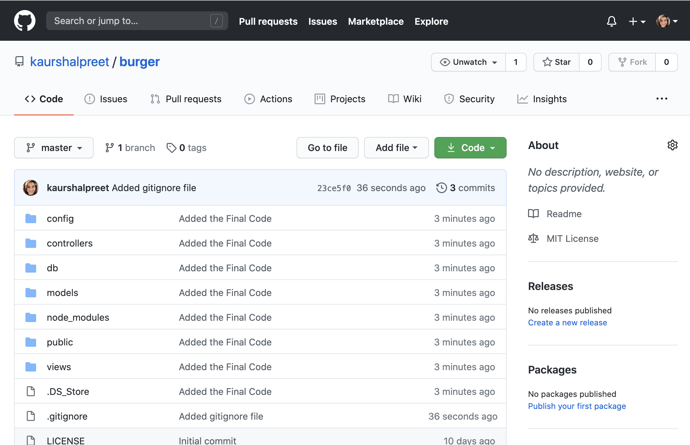
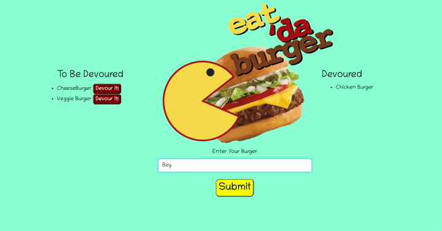

# Eat-Da-Burger

## Description

Eat-Da-Burger is a burger logger app created with MySql, Node, Express and Handlebars. Handlebars is used to generate the HTML page. Node and MySql is used to query and route data in the app. 
 

[The Link to My Github Repository](https://github.com/kaurshalpreet/burger)

---

## Table of Contents

1. [Installation](#Installation)
1. [Usage](#Usage)
1. [Credits](#Credits)
1. [License](#License)

---

## Installation

npm init  
npm i express  
npm i express-handlebars  
npm i mysql  

---

## Usage

 Eat-Da-Burger is a restaurant app that lets user input the names of the burgers they'd like to eat. Whenever a user submits a burger's name, the app will display the burger on the left side of the page - waiting to be devoured. Each Burger on the left side in the waiting area also has a "Devour it!" button. When the user clicks on it, the burger will move to the right side of the page under "Devoured" section. The app will store every burger in database, whether devoured or not.  

Sample Giphy showing the user input and result is shown below.

---

## Credits

- UC Davis BootCamp - Instructors and TAs
- https://www.w3schools.com/
- https://www.youtube.com/
- https://www.google.com/
- https://choosealicense.com/licenses/
- https://shields.io/category/license

---

## License

#### This application is licensed under the [MIT License](https://opensource.org/licenses/MIT)

---

## Questions

#### You can reach me via my [Github](https://github.com/kaurshalpreet) account.

#### Email me with any additional questions at: kaurshalpreet@gmail.com